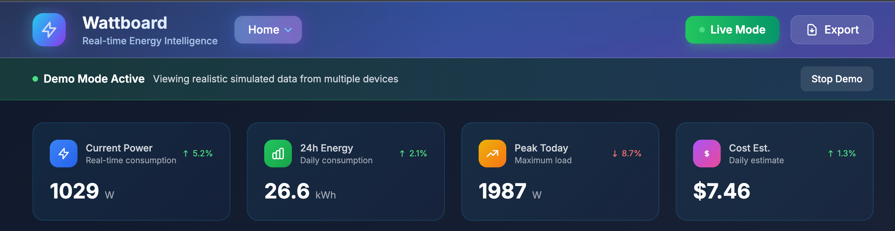
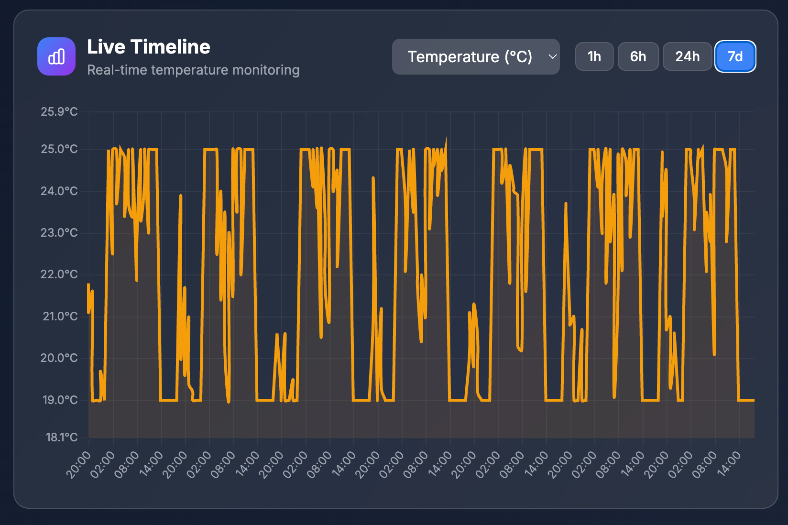
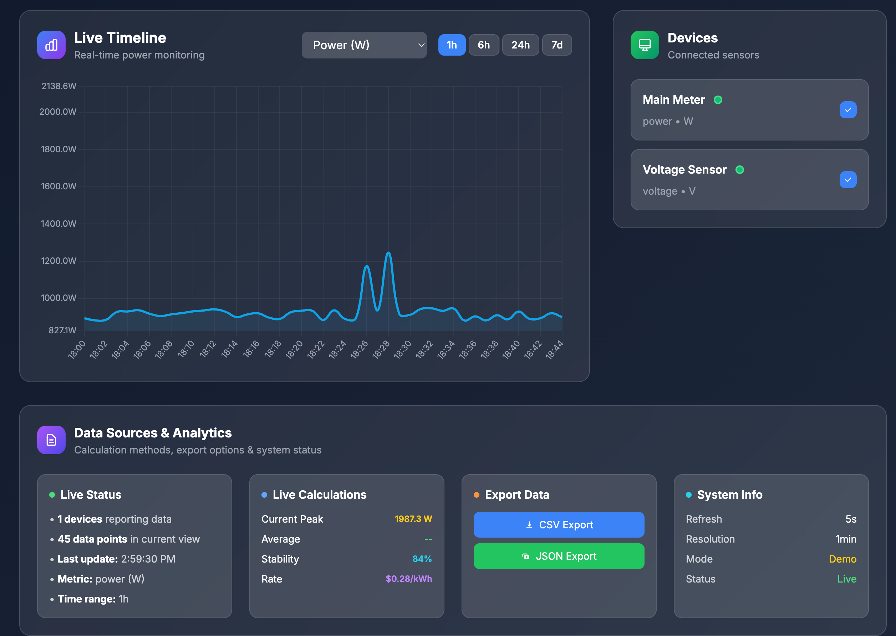

# ⚡ Wattboard - Multi-Site Energy Monitoring Dashboard

**Advanced multi-site energy monitoring dashboard with real-time visualization, smart alerts, and comprehensive analytics. Built for homes, labs, and industrial facilities.**

A comprehensive energy monitoring system that supports multiple sites and arbitrary device types. Built with modern web technologies and designed for scalability from home energy monitoring to industrial applications.

[](https://python.org)
[](https://typescriptlang.org)
[](https://opensource.org/licenses/MIT)
[](https://docker.com)

## 📸 Screenshots

### Main Dashboard - Power Monitoring

*Real-time power monitoring with live calculations, dynamic charts, and comprehensive analytics*

### Temperature Monitoring

*Temperature monitoring with stability indicators and range analysis*

### Multi-Site Overview

*Multi-site energy monitoring with site switching and device management*

### Data Sources & Analytics

*Advanced analytics panel with live calculations, export options, and system information*

## ✨ Features

### 🏢 Multi-Site & Device Abstraction
- **Multiple Sites**: Support for Home, Lab, Office, and any custom sites
- **Device Types**: Power meters, voltage sensors, temperature, AQI, humidity, and more
- **Site Switcher**: Easy navigation between sites with persistent URL state
- **Device Filters**: Real-time filtering by device type and status

### 📊 Real-Time Visualization
- **Live Timeline**: Interactive charts with event ribbons for spikes and sags
- **KPI Cards**: Current power, daily energy, peak values, and cost estimates
- **Event Detection**: Automatic detection of power spikes and voltage sags
- **Responsive Design**: Works on desktop, tablet, and mobile devices

### 🚨 Smart Alerting System
- **3 Preset Rules**: High draw, over-temperature, and no-data alerts
- **Custom Rules**: Create threshold, time-window, and no-data alerts
- **Multiple Delivery**: Email and webhook notifications
- **Snooze Functionality**: Temporarily disable alerts with smart snoozing

### 📈 Data Management
- **CSV/Parquet Import**: Easy data import with column mapping
- **Demo Mode**: Deterministic simulator for instant testing
- **Export Options**: PNG screenshots and CSV data exports
- **Shareable Links**: Permalink URLs that preserve view state

### 🎨 Modern UI/UX
- **Dark Theme**: Beautiful dark interface with design tokens
- **Smooth Animations**: 60fps charts and smooth transitions
- **Accessibility**: WCAG compliant with proper ARIA labels
- **Mobile Responsive**: Optimized for all screen sizes

## 🏗️ Architecture

```
┌─────────────────┐    ┌──────────────┐    ┌─────────────────┐
│   MQTT Devices  │───▶│   Mosquitto  │───▶│   Flask API     │
│   (Real/Sim)    │    │   Broker     │    │   (Python)      │
└─────────────────┘    └──────────────┘    └─────────────────┘
                                                      │
                       ┌─────────────────┐            │
                       │   Next.js UI    │◀────────── ┘
                       │   (React/TS)    │
                       └─────────────────┘
                                │
                       ┌─────────────────┐
                       │   PostgreSQL    │
                       │   + TimescaleDB │
                       └─────────────────┘
```

## 🚀 Quick Start

### Option 1: Demo Mode (Recommended)
```bash
# Clone the repository
git clone <repository-url>
cd Wattboard

# Copy environment file
cp env.example .env

# Start with demo data
docker compose --profile demo up --build

# Open http://localhost:3000
```

### Option 2: Development Mode
```bash
# Start all services with hot reload
docker compose --profile dev up --build

# Frontend: http://localhost:3000
# Backend API: http://localhost:5000
# MQTT Broker: localhost:1883
```

### Option 3: Production Mode
```bash
# Start production services
docker compose --profile prod up --build

# Includes PostgreSQL with TimescaleDB
# Optimized for production workloads
```

## 📋 Docker Compose Profiles

- **`dev`**: Development with hot reload and SQLite
- **`demo`**: Demo mode with simulator and sample data
- **`prod`**: Production with PostgreSQL and TimescaleDB

## 🔧 Configuration

<details>
<summary><strong>📋 Environment Variables</strong></summary>

```bash
# Database Configuration
DATABASE_URL=sqlite:///energy.db  # or postgresql://...

# MQTT Broker Settings
MQTT_BROKER_HOST=broker
MQTT_BROKER_PORT=1883
MQTT_TOPICS=sensor/+/+/reading

# Email Configuration (for alerts)
SMTP_HOST=smtp.gmail.com
SMTP_USER=your-email@gmail.com
SMTP_PASSWORD=your-app-password

# Demo Mode
DEMO_MODE_ENABLED=true

# Application Settings
FLASK_ENV=development
SECRET_KEY=your-secret-key-here
```

</details>

<details>
<summary><strong>📡 MQTT Message Format</strong></summary>

```json
{
  "ts": "2025-01-15T12:00:00Z",
  "site": "Home",
  "device_name": "Main Meter",
  "type": "power",
  "unit": "W",
  "power": 1200.5,
  "voltage": 240.1
}
```

**Supported Device Types:**
- `power` - Power consumption in Watts
- `voltage` - Voltage readings in Volts
- `temp` - Temperature in Celsius
- `aqi` - Air Quality Index
- `humidity` - Humidity percentage

</details>

<details>
<summary><strong>🐳 Docker Compose Profiles</strong></summary>

```yaml
# Development Profile
docker compose --profile dev up --build

# Demo Profile (Recommended for testing)
docker compose --profile demo up --build

# Production Profile
docker compose --profile prod up --build
```

**Profile Differences:**
- **dev**: Hot reload, SQLite, debug mode
- **demo**: Simulator data, sample datasets, quick start
- **prod**: PostgreSQL, TimescaleDB, optimized performance

</details>

## 📊 Data Model

### Sites
- Multiple sites with timezone support
- Default sites: Home, Lab

### Devices
- Flexible device types (power, voltage, temp, aqi, humidity)
- Device capabilities (realtime, historical, alarms)
- Room assignment within sites

### Metrics
- Time-series data with device association
- Support for multiple metric keys per device
- Efficient storage with JSON capabilities

### Events
- Automatic spike/sag detection
- Configurable thresholds and duration
- Event severity classification (1-5)

### Alerts
- Rule-based alerting system
- Multiple notification channels
- Snooze functionality

## 🎯 Use Cases

### Home Energy Monitoring
- Track solar panel output and consumption
- Monitor appliance power usage
- Detect electrical issues early

### Industrial Monitoring
- Equipment health monitoring
- Power quality analysis
- Predictive maintenance

### Smart Building
- HVAC optimization
- Occupancy-based controls
- Energy efficiency tracking

## 🧪 Testing

```bash
# Backend tests
pytest

# Frontend tests
cd frontend && npm test

# Integration tests
docker compose --profile demo up --build
# Run automated tests against demo environment
```

## 📈 Performance

- **API Response Time**: <150ms for 24h queries with ≤5 devices
- **Chart Rendering**: 60fps with smooth animations
- **Data Ingestion**: Handles 1000+ metrics/second
- **Memory Usage**: <100MB for typical workloads

## 🔒 Security

- Input validation and sanitization
- SQL injection prevention
- CORS configuration
- Environment-based secrets

## 🤝 Contributing

1. Fork the repository
2. Create a feature branch
3. Make your changes
4. Add tests
5. Submit a pull request

## 📄 License

MIT License - see LICENSE file for details

## 🆘 Support

- **Documentation**: Check the `/docs` folder
- **Issues**: GitHub Issues for bug reports
- **Discussions**: GitHub Discussions for questions
- **Email**: support@wattboard.dev

## 🔮 Roadmap

- [ ] WebSocket real-time updates
- [ ] Advanced analytics and ML
- [ ] Mobile app (React Native)
- [ ] OAuth authentication
- [ ] Multi-tenant support
- [ ] Advanced alerting rules
- [ ] Data retention policies
- [ ] API rate limiting

---

**Built with ❤️ for the energy monitoring community**

## 🏷️ Repository Topics

`python` `mqtt` `flask` `energy-monitor` `power-consumption` `iot-dashboard`

## 📊 Repository Stats

- **Languages**: Python (35.5%), TypeScript (33.7%), HTML (27.2%), JavaScript (1.7%), CSS (1.1%)
- **License**: MIT
- **Stars**: 0 ⭐
- **Forks**: 0 🍴
- **Issues**: 0 🐛
- **Pull Requests**: 0 🔄
